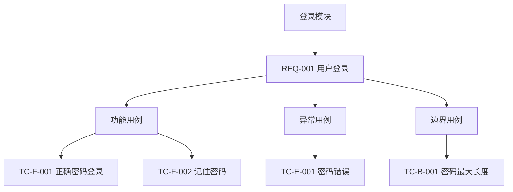

# 用例层级可视化规范（REQ 级三层总览）

> 主表定稿后加载本文件。每条 TC 须在可视化图中有且仅有一处叶子节点；禁止仅有表格而无图。

## 表达目标

按「模块 → REQ → 三层 → TC」展示覆盖关系，与主表编号、层级、标题一致。

## 图表类型（IRON）

**默认使用 `flowchart TB`**，不用 `mindmap`：

- Cursor / VS Code **内置 Markdown 预览对 `mindmap` 支持不完整**，常报 `Mermaid Syntax Error` 且与节点引号无关
- 本项目技术方案文档均使用 `flowchart`，与预览环境一致
- 层级语义与 mindmap 等价，仅布局为自上而下树形

若用户明确要求 mindmap 且确认预览环境为 Mermaid 9.4+（如 Mermaid Live Editor），可改用文末 mindmap 备选格式。

## 粒度与编排

| 规则 | 说明 |
|------|------|
| 一 REQ 一图 | 每个 **REQ-xxx** 单独一个 ` ```mermaid ` 块 |
| 根节点 | 模块/域名称（如 `平台稳定性与灰度`） |
| 二层 | `REQ-xxx REQ 摘要（一行）` |
| 三层（固定） | **功能用例** / **异常用例** / **边界用例** |
| 叶子 | `{TC 编号} {标题}`，与主表同行一致 |
| 空层 | 保留三层分支，叶子写 `暂无` |

**文档编排**：

```
主表 → ## 用例层级总览 → ### REQ-xxx 摘要 → 一个 flowchart 块
```

## flowchart 语法要点

- 首行 `flowchart TB`
- 节点统一 `id["标签"]`；标签内 `"` 改用 `'`
- **节点 id 须 ASCII 唯一**（如 `req_REQ_001`、`req_REQ_001_F`、`TC_F_001`），禁止中文 id
- 边：`父id --> 子id["标签"]`

## 标准示例（flowchart，默认）



空层示例：`req_002_B --> req_002_B_na["暂无"]`

## 与主表对齐规则

1. **先表后图**
2. **全覆盖**：主表每条 TC 恰好在所属 REQ 的图中出现一次
3. **层级一致**：功能/异常/边界 TC 只挂在对应分支下
4. **BLOCKED**：叶子可带 `BLOCKED OPEN-xxx` 后缀

## 自检

- 主表该 REQ 的 TC 条数 = 图中 TC 叶子数？
- 三层分支齐全？
- 抽检叶子「编号 + 标题」与主表一致？
