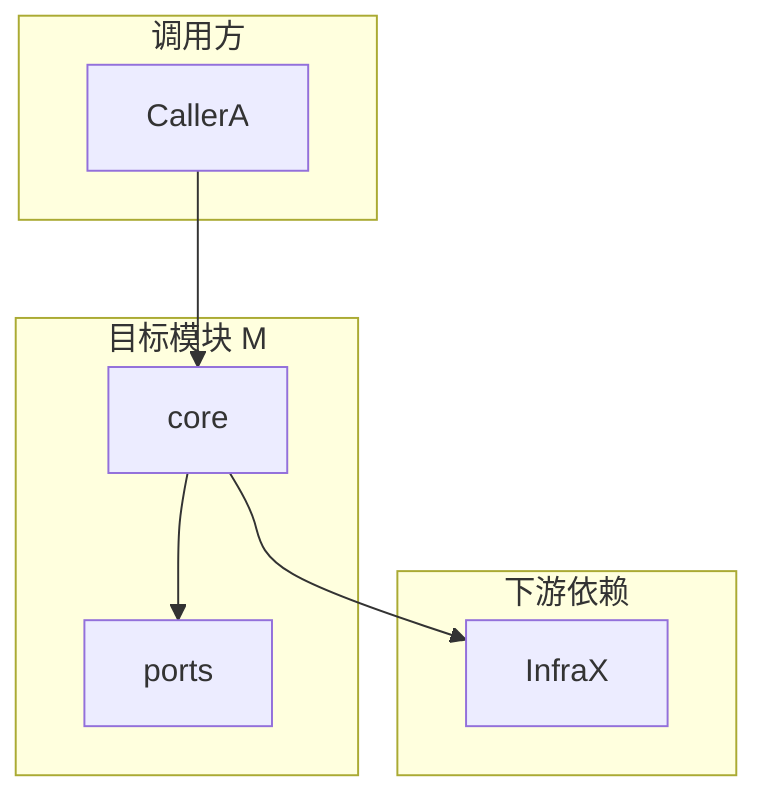

# 调用关系图谱输出规范

## 1. 图例与约定

- **节点**：`模块/文件/类` 三选一粒度；同一轮分析内保持一致。
- **有向边**：`A → B` 表示 A **同步或异步地调用/引用** B（含 import、方法调用、事件派发）。
- **边标签**（可选）：`sync` / `async` / `event` / `ipc` / `db` / `http`。
- **入口**：显式列出本模块的**公共入口**（导出 API、IPC handler、路由、CLI 等）。

## 2. 推荐：Mermaid（分层或子图）

复杂域可拆多张图：**向下调用图**、**横向耦合图**（模块间环）、**数据与副作用图**（读写哪些外部资源）。

## 3. 推荐：边表（便于评审与追踪）

| From | To | 关系 | 证据（符号/文件:行） | 风险备注 |
|------|----|------|---------------------|----------|
| ... | ... | import/call/event | ... | 环依赖/穿透访问/热路径 |

## 4. 必交付小节

1. **模块职责一句话**（对外承诺）。
2. **不变量与禁止事项**（例如不得缓存未授权数据）。
3. **耦合热点 Top N**（按变更传播成本排序）。
4. **与目标结构的差距**（仅陈述，不在此步改代码）。
