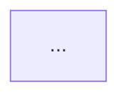

# understand 调用链路

## 何时加载

- Step 0.2 建链时**必读**
- Step 8 归档前图谱同步时**必读**

## 前置 ⛔

1. 无 `.understand-anything/knowledge-graph.json` → 加载 `understand-install.md`，安装并 `/understand`
2. 图谱陈旧 → `/understand --update`
3. 可选：`/understand-chat` 结果须落盘到范围卡片

## 检索步骤

```text
Read .understand-anything/meta.json
Read .understand-anything/knowledge-graph.json limit ~40

Grep "{模块名|类名|方法名|路由|API}" .understand-anything/knowledge-graph.json
Grep "function:..." .understand-anything/knowledge-graph.json   # 对命中 node 查入边/出边
```

| 字段 | 用途 |
|------|------|
| `nodes[].id` | 证据锚点 |
| `nodes[].filePath` / `summary` | 文件与职责 |
| `edges[].type` | `calls` / `imports` / `contains` |

有 `domain-graph.json` 时：先读业务域，再回 knowledge-graph 定位实现。

## 范围卡片模板（写入《技术方案》）

```markdown
## 范围卡片

### 物理边界
- 路径/包名：…

### 行为等价入口
| node id | 文件:符号 | 说明 |
|---------|-----------|------|

### 调用链路摘要
1. 入口 → … → 副作用点（I/O、事件、网络、持久化）

### 调用关系 Mermaid


### 图谱元数据
- 来源：`.understand-anything/knowledge-graph.json` 或「手工分析」
- lastAnalyzedAt：…
- 查询关键词：…

### 完成标准
- …
```

Mermaid 规则见 `call-graph-output.md`；边冲突以 **node id + 代码 Read** 为准。

## 归档前增量更新 ⛔

1. `/understand --update`（本轮有业务代码变更时**必须**）
2. 核对 `meta.json` → `lastAnalyzedAt`
3. 与范围卡片主路径再检索；不一致 → 更新落盘并记「图谱归档同步修订」

## 禁止

- 无证据编造调用链
- 范围卡片仅存在于对话
- 合入前未 `--update` 就定稿终版 QA 评估
