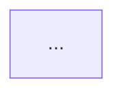

# understand 调用链路（存量理解）

## 何时加载

- Step 0.2 建链时**必读**
- Step 7.5 合入后图谱同步时**必读**

## 前置 ⛔

1. 无 `.understand-anything/knowledge-graph.json` → 加载 `understand-install.md`
2. 图谱陈旧 → `/understand --update`

## 检索步骤

```text
Read .understand-anything/meta.json
Read .understand-anything/knowledge-graph.json limit ~40

Grep "{模块名|类名|方法名|路由|API}" .understand-anything/knowledge-graph.json
Grep "function:..." .understand-anything/knowledge-graph.json
```

| 字段 | 用途 |
|------|------|
| `nodes[].id` | 证据锚点 |
| `nodes[].filePath` / `summary` | 文件与职责 |
| `edges[].type` | `calls` / `imports` / `contains` |

## 影响范围分析（新增功能专用）

除主调用链外，须列出：

| 类别 | 说明 |
|------|------|
| **直接上游** | 谁会调用到挂载点 |
| **直接下游** | 挂载点会触发哪些副作用 |
| **间接影响** | 共享状态、配置、事件总线 |
| **不应受影响** | 显式列出须保持行为不变的路径 |

范围大时加载 `影响范围模板.md` 深化。

## 范围卡片模板（写入《技术方案》§ 范围卡片）

```markdown
## 范围卡片

### 物理边界
- 路径/包名：…

### 存量入口（理解锚点）
| node id | 文件:符号 | 职责摘要 |
|---------|-----------|----------|

### 新功能挂载点候选
| 候选 | 文件:符号 | 选用理由 |
|------|-----------|----------|

### 调用链路摘要
1. 上游入口 → … → 挂载点 → 下游副作用

### 调用关系 Mermaid


### 不应受影响的路径
- …

### 图谱元数据
- 来源：`.understand-anything/knowledge-graph.json` 或「手工分析」
- lastAnalyzedAt：…
```

## 禁止

- 无 node id / 文件证据的「据说会调用」
- 遗漏「不应受影响」路径导致回归遗漏
