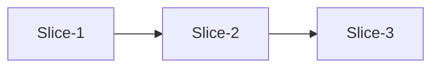

# 实施计划模板（存量模块新增功能）

与 `refactor-feature-addition` Step 4 配套；切片须与《技术方案》§5「最小改动证据」及三向追溯矩阵「实施计划切片」列对齐。

## 1. 元数据
- 模块名：
- 版本：
- 上游文档：需求拆解 v…、技术方案 v…
- 预估总切片数：

## 2. 实施顺序总览

## 3. 切片明细

| 切片 ID | 覆盖 REQ | 目标 | 文件/符号 | 改动类型 | 依赖切片 | 回滚点 |
|---------|----------|------|-----------|----------|----------|--------|
| Slice-1 | REQ-001 | 新增挂载点 | `src/foo/bar.ts::handleX` | 新增函数 | — | 删除新函数 |
| Slice-2 | REQ-002 | 接入上游 | `src/api/order.ts` | 扩展调用 | Slice-1 | revert commit … |

## 4. 每片验收标准

### Slice-1
- 完成定义：…
- 对应研发 TC：RD-TC-01
- 单测命令：…

### Slice-2
- …

## 5. 风险与 defer
| 项 | 风险 | 缓解 | 是否 defer |
|----|------|------|------------|
| … | … | … | 是/否 |

## 6. 与最小改动证据预对齐

| 文件 | 计划改动 | 对应切片 | 是否可避免 |
|------|----------|----------|------------|
|  |  |  |  |
