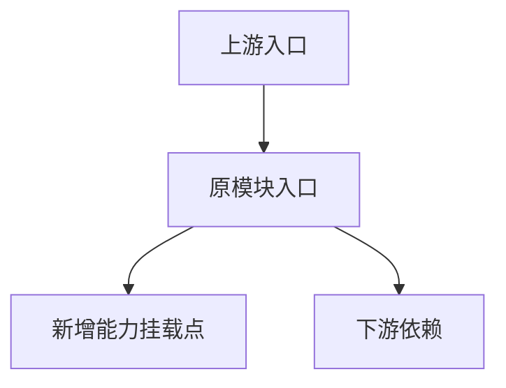

# 技术方案模板（存量模块新增功能）

与 `refactor-feature-addition` 工作流配套：先填 §1–§2 再展开设计；§5「最小改动证据」须与最终实现 diff 对齐。

## 1. 原模块职责复述
- 用一段话说明原模块职责、不变量、对外契约：

## 2. 上下游调用链与影响范围
### Mermaid 图

### 影响范围说明
- 上游入口：
- 下游依赖：
- 共享数据 / 配置：

## 3. 新功能需求与边界
### 范围内
- 

### 非范围
- 

## 4. 设计方案
- 接口：
- 数据结构：
- 处理流程：
- 与既有逻辑的集成点：

## 5. 最小改动证据
| 文件 | 改动类型 | 改动原因 | 是否可避免 |
|---|---|---|---|
|  |  |  |  |

## 6. SOLID 遵循说明
- 

## 7. 风险与回滚
- 

## 8. 测试映射
| 需求点 | 对应测试用例 |
|---|---|
| F1 |  |
