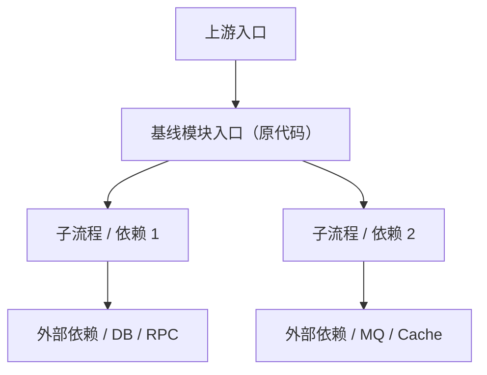

# 调用关系图模板

## 1. 模块职责摘要
- 

## 2. Mermaid 调用关系图

```mermaid
graph TD
    Caller[上游入口] --> BL[基线模块入口（原代码）]
    BL --> S1[子流程 / 依赖 1]
    BL --> S2[子流程 / 依赖 2]
    S1 --> D1[外部依赖 / DB / RPC]
    S2 --> D2[外部依赖 / MQ / Cache]
```

## 3. 影响范围说明
- 上游入口：
- 下游依赖：
- 共享数据结构：
- 错误传播路径：

## 4. vn 目标挂载点
- 新入口：
- 切换点 / 开关：
- 回滚路径：
